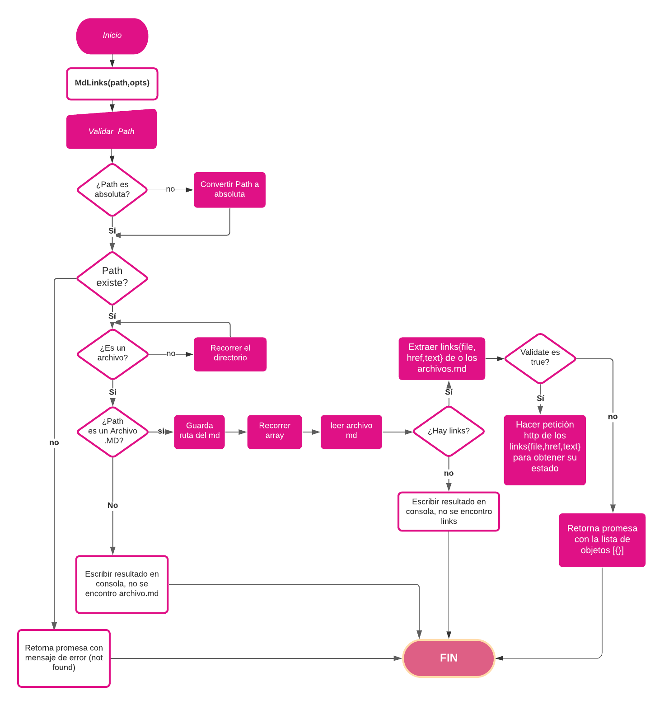
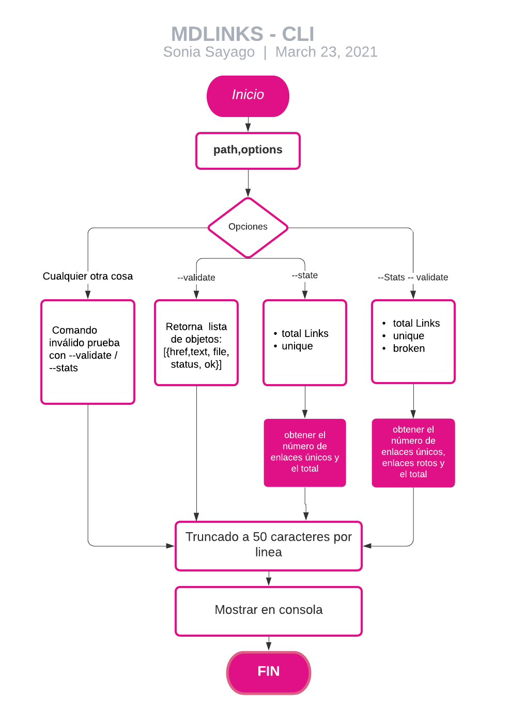

# Markdown Links

## Índice

* [1. Resumen del proyecto](#1-resumen-del-proyecto)
* [3. Checklist](#3-checklist)

***

## 1. Resumen del proyecto

#  Libreria Markdown Links

Este proyecto presenta una libreria que verifica las links dentro de cada archivo con extensión ".md" (markdown)
y permite validar dichos links y realizar algunas estadisticas.

La librería esta implementada en JavaScript para ser ejecutada con Node.js.

## Necesidad del usuario:


### Modulos utilizados
  Implementa los modulos de node.js:

  - fs
  - path
  - console


## Pruebas unitarias
    Para las pruebas unitarias se utilizó Jest.

## Instalación
    Instalar la libreria via :
```
npm install SoniaSayago-mdlinks
```

## Guia de Uso

### A traves de la Interfaz de Línea de Comando(CLI)

El ejecutable de la aplicaión se puede ejecutar de la siguiente
manera a través de la terminal:

`md-links <path> [options]`

Por ejemplo:

```sh
$ md-links ./some/example.md
./some/example.md http://algo.com/2/3/ Link a algo
./some/example.md https://otra-cosa.net/algun-doc.html algún doc
./some/example.md http://google.com/ Google
```
#### Options

##### `--validate`

Si pasamos la opción `--validate`, el módulo debe hacer una petición HTTP para
averiguar si el link funciona o no. Si el link resulta en una redirección a una
URL que responde ok, entonces consideraremos el link como ok.

Por ejemplo:

```sh
$ md-links ./src/Pruebas --validate
https://developer.mozilla.org/es/docs/Glossary/Callback_function Mozilla C:\Users\N20\Documents\GitHub\LIM014-mdlinks\src\Pruebas\archivo1.md 200 OK
https://nodejs.org/es/download/ Node C:\Users\N20\Documents\GitHub\LIM014-mdlinks\src\Pruebas\archivo1.md 200 OK
https://httpstat.us/404 http error  C:\Users\N20\Documents\GitHub\LIM014-mdlinks\src\Pruebas\archivo1.md 404 fail

```

Vemos que el _output_ en este caso incluye la palabra `ok` o `fail` después de
la URL, así como el status de la respuesta recibida a la petición HTTP a dicha
URL.

##### `--stats`

Si pasamos la opción `--stats` el output (salida) será un texto con estadísticas
básicas sobre los links.

```sh
$ md-links ./src/Pruebas --stats
Total: 6
Unique: 6
```

También podemos combinar `--stats` y `--validate` para obtener estadísticas que
necesiten de los resultados de la validación.

```sh
$ md-links ./src/Pruebas --stats --validate
Total: 6
Unique: 6
Broken: 1
```

## **Diagramas de Flujo**





## 3. Objetivos de aprendizaje

Diseñar tu propia librería es una experiencia fundamental para cualquier
desarrollador porque que te obliga a pensar en la interfaz (API) de tus
_módulos_ y cómo será usado por otros developers. Debes tener especial
consideración en peculiaridades del lenguaje, convenciones y buenas prácticas.

A continuación puedes ver los objetivos de aprendizaje de este proyecto:

### JavaScript

* [ ] Uso de condicionales (if-else | switch | operador ternario)
* [ ] [Uso de funciones (parámetros | argumentos | valor de retorno)](https://developer.mozilla.org/es/docs/Web/JavaScript/Referencia/Funciones)
* [ ] [Manipular arrays (filter | map | sort | reduce)](https://code.tutsplus.com/es/tutorials/how-to-use-map-filter-reduce-in-javascript--cms-26209)
* [ ] [Manipular objects (key | value)](https://developer.mozilla.org/es/docs/Web/JavaScript/Referencia/Objetos_globales/Object)
* [ ] Uso ES modules ([`import`](https://developer.mozilla.org/en-US/docs/Web/JavaScript/Reference/Statements/import)
| [`export`](https://developer.mozilla.org/en-US/docs/Web/JavaScript/Reference/Statements/export))
* [ ] [Diferenciar entre expression y statements.](https://openclassrooms.com/en/courses/4309531-descubre-las-funciones-en-javascript/5108986-diferencia-entre-expresion-y-sentencia)
* [ ] [Diferenciar entre tipos de datos atómicos y estructurados.](https://developer.mozilla.org/es/docs/Web/JavaScript/Data_structures)
* [ ] [Uso de callbacks.](https://developer.mozilla.org/es/docs/Glossary/Callback_function)
* [ ] [Consumo de Promesas.](https://scotch.io/tutorials/javascript-promises-for-dummies#toc-consuming-promises)
* [ ] [Creación de Promesas.](https://www.freecodecamp.org/news/how-to-write-a-javascript-promise-4ed8d44292b8/)

### Node

* [ ] Uso de sistema de archivos. ([fs](https://nodejs.org/api/fs.html), [path](https://nodejs.org/api/path.html))
* [ ] Instalar y usar módulos. ([npm](https://www.npmjs.com/))
* [ ] Creación de modules. [(CommonJS)](https://nodejs.org/docs/latest-v0.10.x/api/modules.html)
* [ ] [Configuración de package.json.](https://docs.npmjs.com/files/package.json)
* [ ] [Configuración de npm-scripts](https://docs.npmjs.com/misc/scripts)
* [ ] Uso de CLI (Command Line Interface - Interfaz de Línea de Comando)

### Testing

* [ ] [Testeo unitario.](https://jestjs.io/docs/es-ES/getting-started)
* [ ] [Testeo asíncrono.](https://jestjs.io/docs/es-ES/asynchronous)
* [ ] [Uso de librerias de Mock.](https://jestjs.io/docs/es-ES/manual-mocks)
* [ ] Uso de Mocks manuales.
* [ ] Testeo para múltiples Sistemas Operativos.

### Estructura del código y guía de estilo

* [ ] [Organizar y dividir el código en módulos (Modularización)](https://medium.com/@sebastianpaduano/modularizaci%C3%B3n-en-javascript-538bd6c75fa)
* [ ] Uso de identificadores descriptivos ([Nomenclatura](http://snowdream.github.io/javascript-style-guide/javascript-style-guide/es/naming-conventions.html) | [Semántica](https://geekytheory.com/semantica-coder))
* [ ] Uso de linter (ESLINT)

### Git y GitHub

* [ ] [Uso de comandos de git (add | commit | pull | status | push)](https://github.com/jlord/git-it-electron)
* [ ] Manejo de repositorios de GitHub (clone | fork | gh-pages)
* [ ] Colaboración en Github (branches | pull requests | |[tags](https://git-scm.com/book/en/v2/Git-Basics-Tagging))
* [ ] Organización en Github (projects | issues | labels | milestones)

### HTTP

* [ ] Verbos HTTP ([http.get](https://nodejs.org/api/http.html#http_http_get_options_callback))

### Fundamentos de programación

* [ ] [Recursión.](https://www.youtube.com/watch?v=lPPgY3HLlhQ)

***

## 4. Consideraciones generales

* Este proyecto se debe "resolver" de manera individual.

* La **librería** y el **script ejecutable** (herramienta de línea de comando -
  CLI) deben estar implementados en JavaScript para ser ejecutados con
  Node.js. **Está permitido usar librerías externas**.

* Tu módulo **debe ser instalable** via `npm install <github-user>/md-links`. Este
  módulo debe incluir tanto un _ejecutable_ que podamos invocar en la línea de
  comando como una interfaz que podamos importar con `require` para usarlo
  programáticamente.

* Los **tests unitarios** deben cubrir un mínimo del 70% de _statements_,
  _functions_, _lines_ y _branches_. Te recomendamos explorar [Jest](https://jestjs.io/)
  para tus pruebas unitarias.

* Para este proyecto **no está permitido** utilizar `async/await`.

* Para este proyecto es **opcional** el uso de ES Modules `(import/export)`, en el
  caso optes utilizarlo deberás de crear un script de `build` en el `package.json`
  que los transforme en `requires` y `module.exports` con ayuda de **babel**.

## 4. Checklist

### General

* [x] Puede instalarse via `npm install --global <github-user>/md-links`

### `README.md`

* [x] Un board con el backlog para la implementación de la librería.
* [x] Documentación técnica de la librería.
* [x] Guía de uso e instalación de la librería

### API `mdLinks(path, opts)`

* [x] El módulo exporta una función con la interfaz (API) esperada.
* [x] Implementa soporte para archivo individual
* [x] Implementa soporte para directorios
* [x] Implementa `options.validate`

### CLI

* [x] Expone ejecutable `md-links` en el path (configurado en `package.json`)
* [x] Se ejecuta sin errores / output esperado
* [x] Implementa `--validate`
* [x] Implementa `--stats`

### Pruebas / tests

* [x] Pruebas unitarias cubren un mínimo del 70% de statements, functions,
  lines, y branches.
* [x] Pasa tests (y linters) (`npm test`).
